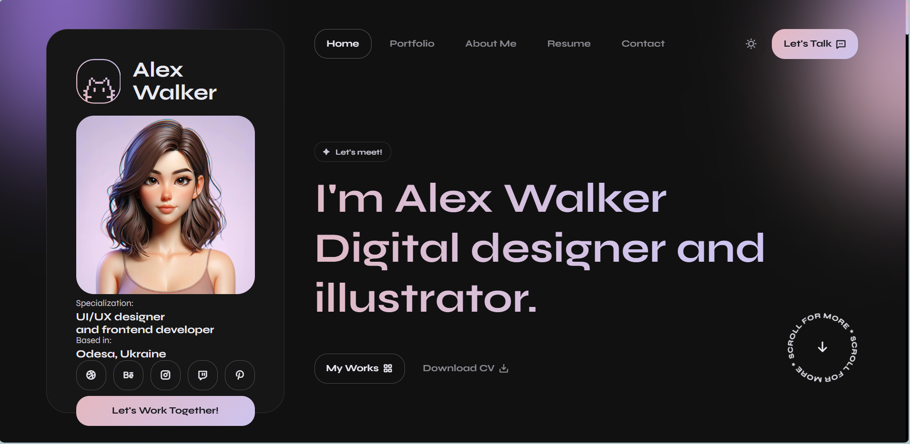
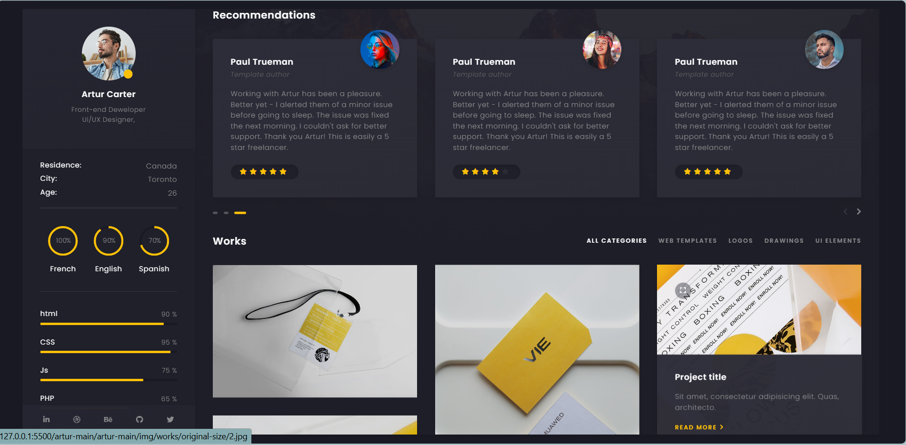
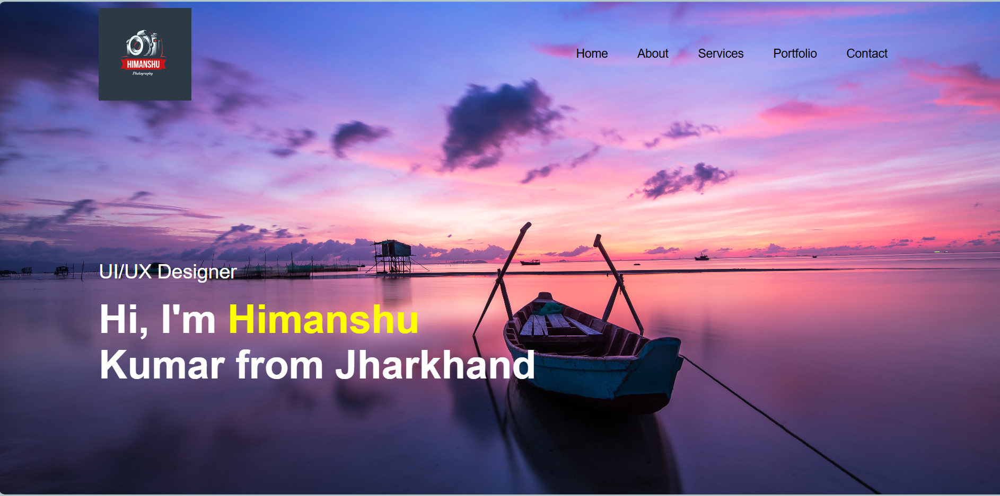

# Portfolio Collection

A collection of three responsive portfolio website projects built to explore modern personal branding, UI/UX design, frontend development, and creative web presentation.

## ✨ Featured Portfolios

### 1. Alex Portfolio

A modern digital designer portfolio featuring a dark interface, soft purple/pink gradients, project showcases, profile information, and a clean navigation experience.



**Project:** [View Alex Portfolio](./alex-wender-main/)

---

### 2. Artur Portfolio

A creative portfolio layout focused on frontend development and UI/UX design. It includes recommendations, project/work galleries, education, work history, newsletter content, and a contact section.



**Project:** [View Artur Portfolio](./artur-main/)

---

### 3. My Portfolio

A personal portfolio website with a photography-inspired hero section, About Me, Services, My Work, and Contact sections. The design uses a dark theme with bright accent colors and large visual sections.



**Project:** [View My Portfolio](./my%20portfolio/)

---

## 🛠️ Technologies

The projects are primarily built with web technologies such as:

- HTML5
- CSS3
- JavaScript
- Responsive Web Design
- UI/UX Design
- Modern web layout and styling techniques

> The exact technologies may vary between the individual projects.

## 📁 Repository Structure

```text
portfolio/
├── README.md
├── screenshots/
│   ├── alex-portfolio.png
│   ├── artur-portfolio.png
│   └── my-portfolio.png
├── alex-wender-main/
├── artur-main/
└── my portfolio/
```

## 🚀 Running the Projects Locally

Clone the repository:

```bash
git clone https://github.com/Himanshu6389/portfolio.git
cd portfolio
```

Then open any project folder and follow the instructions in its `package.json` (if present).

For projects using npm:

```bash
npm install
npm run dev
```

If a project is a static HTML/CSS/JavaScript website, it can also be opened using a local development server such as VS Code Live Server.

## 📸 Screenshots

Representative screenshots of all three portfolio projects are included in the [`screenshots`](./screenshots/) folder.

## 🎯 Purpose

This repository brings together multiple portfolio implementations to demonstrate:

- Personal portfolio design
- Frontend development
- UI/UX concepts
- Responsive layouts
- Creative visual presentation
- Project showcase design

## 👨‍💻 Author

**Himanshu Kumar**

GitHub: [Himanshu6389](https://github.com/Himanshu6389)

## 📄 License

This repository is intended for portfolio and educational purposes. Check the individual project folders for any original template or third-party asset licensing information.
